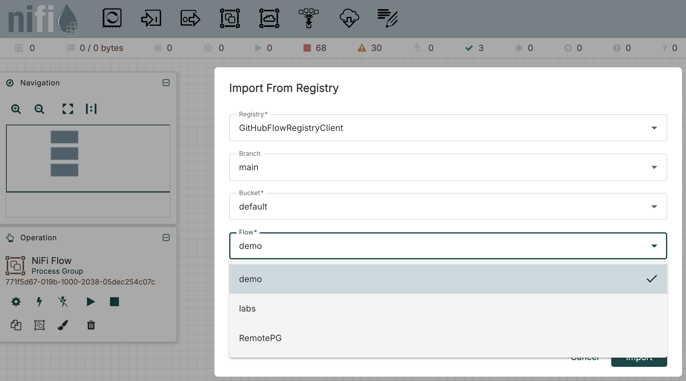

# nifi_flows (local Docker stack)

Here is the flows were built in nifi 2.x for BigDataSchool course
Minimal local environment for developing and testing Apache NiFi flows.

This stack runs:
- Apache NiFi **2.5.0** (single node, HTTPS)
- NiFi Registry **2.5.0**
- Apache Kafka (single broker)
- PostgreSQL

Designed for **local development**

## Requirements

- Docker
- Docker Compose (v2+)

Tested on macOS (Apple Silicon / M2).

## How to run

From the **repository root**:

```bash
docker compose -f docker/docker-compose.yml up -d
```

## How to stop

From the **repository root**:

```bash
docker compose -f docker/docker-compose.yml stop
```

## How to remove everything

From the **repository root**:

```bash
docker compose -f docker/docker-compose.yml down -v
```

## UI access

``` https://localhost:8443/nifi```

username: admin

password: adminadminadmin

## Import NiFi Flows from GitHub

1. In NiFi UI → **Controller Settings** → **Registry Clients** → **+**.
2. Select **GitHubFlowRegistryClient** and set:
   - **API URL**: `https://api.github.com`
   - **Repository Owner**: `Ilia2704`
   - **Repository Name**: `nifi_flows`
   - **Default Branch**: `main`
   - **Repository Path**: ``
   - **Auth**: None (public repo)
3. Apply → on canvas **Add** → **Import from Registry** → pick your flow.



## Flow description:

### RemotePG 
### Remote Process Group & MiNiFi integration

**Purpose**  
Demonstrates how to build destination flows that receive data from external NiFi clusters and MiNiFi agents using Remote Process Groups (RPG).

**Key concepts covered**
- Remote Input / Output Ports
- Receiving data from:
  - another NiFi cluster
  - MiNiFi agents
- Attribute enrichment using `UpdateAttribute`
- Centralized entry point for distributed data ingestion

**Typical use cases**
- Edge → Core NiFi ingestion
- MiNiFi → NiFi pipelines
- Cross-cluster flow routing

Shows how NiFi is used in distributed environments and how remote connectivity is organized.


### LABS
### Student practice flows (core data engineering patterns)

**Purpose**  
A collection of training flows for students to practice building real-world Apache NiFi pipelines.

**Key concepts covered**
- General data pipeline construction
- Record-oriented processing:
  - `ConvertRecord`
  - `MergeRecord`
  - `SplitRecord`
- JSON processing:
  - `EvaluateJsonPath`
  - `FlattenJson`
- Data enrichment and joins
- Flow routing and prioritization
- Writing data to local storage using `PutFile`
- HTTP-based integrations with `InvokeHTTP`
- SQL / database-oriented pipeline patterns (conceptual)

**Typical use cases**
- Hands-on exercises during the course
- Learning how processors connect into complete pipelines
- Practicing data transformation and enrichment
- Understanding backpressure and flow control

Provides a safe playground for experimenting with NiFi fundamentals and common data engineering patterns.


### DEMO  
### Feature demonstrations & advanced examples

**Purpose**  
A set of compact demo flows illustrating specific Apache NiFi features and best practices.

**Key concepts covered**
- NiFi Expression Language (EL)
- Dynamic attributes and metadata manipulation
- JSON transformations using `JoltTransformJSON`
- Flow optimization techniques
- Process Group (PG) configuration:
  - batching
  - scheduling
  - layout orientation
- Kafka integration:
  - `PublishKafka`
  - `ConsumeKafka`
- Script-based processing examples (conceptual)

**Typical use cases**
- Live demonstrations during lectures
- Explaining processor behavior and configuration
- Reference examples for building optimized flows
- Quick experimentation with advanced features

Helps practitioners understand advanced NiFi capabilities and internal mechanics.

## Scope & limitations

This repository is intended for:
- local development
- learning and experimentation

It does not cover:
- production security
- HA NiFi clusters
- secrets management


# Related Projects

**Custom Python Processor for Apache NiFi**  
  Repository containing a custom Apache NiFi processor implemented in Python.  
  Demonstrates how to extend NiFi with Python-based logic for custom data processing use cases.  
     https://github.com/Ilia2704/nifi-extentions-python
